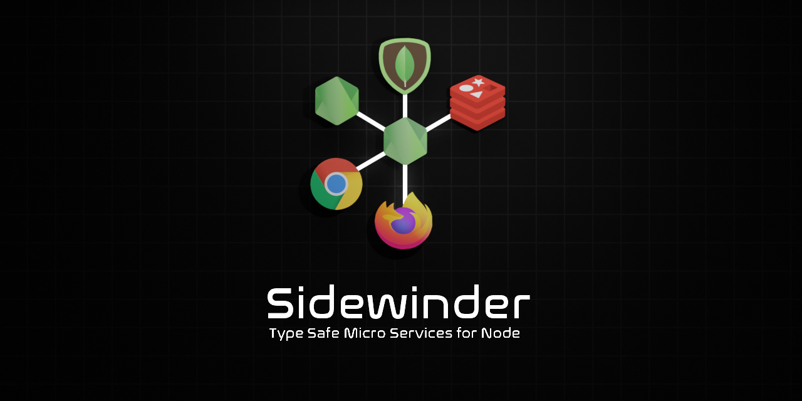

<div align='center'>

<h1>Sidewinder</h1>

<p>Type Safe RPC Services for Node</p>



<br />
<br />

[](https://www.npmjs.com/package/@sidewinder/contract)
[](https://www.npmjs.com/package/@sidewinder/client) 
[](https://www.npmjs.com/package/@sidewinder/server)
[](https://github.com/sinclairzx81/sidewinder/actions)

</div>

## Overview

Sidewinder is a strictly typed RPC client and server framework for Node. It is designed for microservice architectures and enables one to define type safe communication contracts which can be shared between client and server. It automatically handles runtime validation of data received over the network and provides automatic static type inference for RPC methods in TypeScript.

Sidewinder is developed around a [Runtime Type System](https://github.com/sinclairzx81/typebox) based on JSON Schema. It encodes runtime type information as JSON Schema into JavaScript and uses TypeScript type inference to statically infer associated static types at compile time. This approach enables distributed applications to be statically checked with the TypeScript compiler, with the same runtime type assertions handled via standard JSON Schema validation at runtime.

Sidewinder services use JSON RPC 2.0, JSON Schema and MsgPack for optional binary message encoding. It offers both Http and Web Socket service types with Web Sockets services supporting full duplex and connection retry.

License MIT

## Contents

- [Overview](#Overview)
- [Install](#Install)
- [Usage](#Usage)
- [Metadata](#Metadata)
- [Packages](#Packages)
- [Build](#Build)

## Install

Sidewinder provides seperate packages for Server and Client environments.

```bash
$ npm install @sidewinder/contract   # Service Description Contract
$ npm install @sidewinder/client     # Http and Web Socket Client Types
$ npm install @sidewinder/server     # Http and Web Socket Service Types
```

## Usage

Sidewinder applications consist of three main components, the Contract, Client and Service. The following sets up a echo service using the WebService and WebClient.

[TypeScript Example Link](https://www.typescriptlang.org/play?#code/JYWwDg9gTgLgBAbzgFQJ5gKZwL5wGZQQhwDkAAgM7AAmGA7sAHa1QD0AxhIzFAIbswSAKFCRYiOAHUMAIwDKGKADdg7LLgJFSlGvSYtWFRUsXDR0eEmkyAwgBtgGbjnyFi5KrQbNFHB08EhIVZWOABaCMio6JjYuPiExPjg0JsuHn4YFPCk3Lz8gqigzkYKeDTuPgE4AF4UdAwAOgqMgQAKBCE4brgjZUUALkQuntGSXmpqEiG0TEaAMQBXRgFgLjaAbVmmgDlFkBlFNoBKABp6ub2Do+OAXXPtxqvDqBPjke7sIWx37ML-gGAsLZBTKVQYP5AqHQuLFLhlXrGcG1OCMehSWSglRqNotKowX59bFNEAYGAACwg1Da40mJHObXY-m4AElqOdeOcZMdagA+YajEKjUYAH2F4rFwpFHzgQvFcEl8u6ip6AGpInAwLw+CAKHA2rwhox9i8uUaTYp3oLQvKVbaZXKJUq1RrlsAAI6LLBMxzOXTcYB4RxQB02iWhpXqiJwUkUqmo3ikuBMPCKKAYaiuLQlVpZa2hiOjKNhODpmCLKCMZOMVNQdOZ3h6gAGxuuUCbhZ60tGZYrVd4cFVcBkcG+vyFMMnU+y9l9WQnU8XQLhpXgPoCKLRdAxtmZMFx6Xx5xI5JgMDAAxCjWvjRIvxKCPTFEWdngdV4dF4wDXe8a7F4dh2DSExTOcACM4HvI6CrOrBTpKtK0F2nBzrIS60bagA5vsAR6o2+qxpS1BDGUUBMJhHLmm2ZqohaUBQWGMEoShYrZF2zEocWMZkkRCZJimaYZlmxA5vibHKuJg4ak+L7wMAzati8TZAA)

```typescript
import { Type }             from '@sidewinder/contract'
import { Host, WebService } from '@sidewinder/server'
import { WebClient }        from '@sidewinder/client'

// ---------------------------------------------------------------------------
// Contract
// ---------------------------------------------------------------------------

const Contract = Type.Contract({
    format: 'msgpack',
    server: {
        'echo': Type.Function([Type.String()], Type.String())
    }
})

// ---------------------------------------------------------------------------
// Service
// ---------------------------------------------------------------------------

const service = new WebService(Contract)

service.method('add', (clientId, a, b) => {
    //        │           │      │
    //        │           │      └─── params (a: number, b: number)
    //        │           │
    //        │           └─── unique client identifier
    //        │
    //        └─── method name inferred from contract
    //
    //
    //     ┌─── return inferred as `number`
    //     │
    return a + b 
})

const host = new Host()

host.use('/api', service)

host.listen(5000)


// ---------------------------------------------------------------------------
// Client
// ---------------------------------------------------------------------------

const client = new WebClient(Contract, 'http://localhost:5000/api')

const result = await client.call('add', 1, 1)
//    │                         │         │
//    │                         │         └─── arguments as (method: string, a: number, b: number)
//    │                         │ 
//    │                         └─── method name inferred from contract
//    │
//    └─── result is `number`
```


## Metadata

Sidewinder Contracts are serializable JavaScript objects with embedded JSON schema. Contracts can be used for machine readable schematics and published to remote systems, or used to generate human readable documentation.

```typescript

const Contract = Type.Contract({                                         // const Contract = {
  format: 'json',                                                        //   type: 'contract',
  server: {                                                              //   format: 'json',
    add: Type.Function([Type.Number(), Type.Number()], Type.Number()),   //   server: {
    sub: Type.Function([Type.Number(), Type.Number()], Type.Number()),   //     add: {
    mul: Type.Function([Type.Number(), Type.Number()], Type.Number()),   //       type: 'function',
    div: Type.Function([Type.Number(), Type.Number()], Type.Number()),   //       returns: { type: 'number' },
  }                                                                      //       parameters: [
})                                                                       //         { type: 'number' },
                                                                         //         { type: 'number' }
                                                                         //       ]
                                                                         //     },
                                                                         //     sub: {
                                                                         //       type: 'function',
                                                                         //       returns: { type: 'number' },
                                                                         //       parameters: [
                                                                         //         { type: 'number' },
                                                                         //         { type: 'number' }
                                                                         //       ]
                                                                         //     },
                                                                         //     mul: {
                                                                         //       type: 'function',
                                                                         //       returns: { type: 'number' },
                                                                         //       parameters: [
                                                                         //         { type: 'number' },
                                                                         //         { type: 'number' }
                                                                         //       ]
                                                                         //     },
                                                                         //     div: {
                                                                         //       type: 'function',
                                                                         //       returns: { type: 'number' },
                                                                         //       parameters: [
                                                                         //         { type: 'number' },
                                                                         //         { type: 'number' }
                                                                         //       ]
                                                                         //     }
                                                                         //   }
                                                                         // }
```

## Build

Sidewinder is built as a mono repository with each publishable package located under the libs directory. Sidewinder uses the [Hammer](https://github.com/sinclairzx81/hammer) build tooling for automated tests, builds and publishing. Sidewinder requires Node 14 LTS. The following shell commands clone the project and outline the commands provide through npm scripts.

```bash
# clone
$ git clone git@github.com:sinclairzx81/sidewinder.git
$ cd sidewinder
$ npm install

# tasks
$ npm start         # starts the example project
$ npm test          # runs the full sidewinder test suite
$ npm test channel  # runs the sidewinder channel test suite only
$ npm run format    # runs code formatting across the project
$ npm run build     # builds all packages to target/build
$ npm run clean     # cleans all build artifacts
```